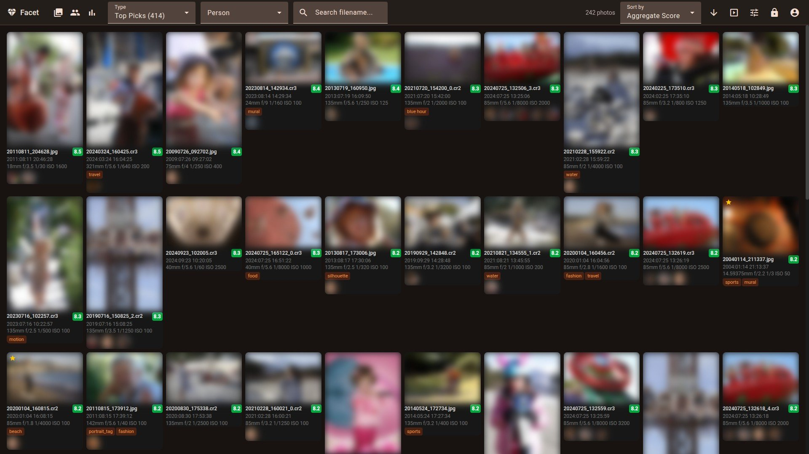
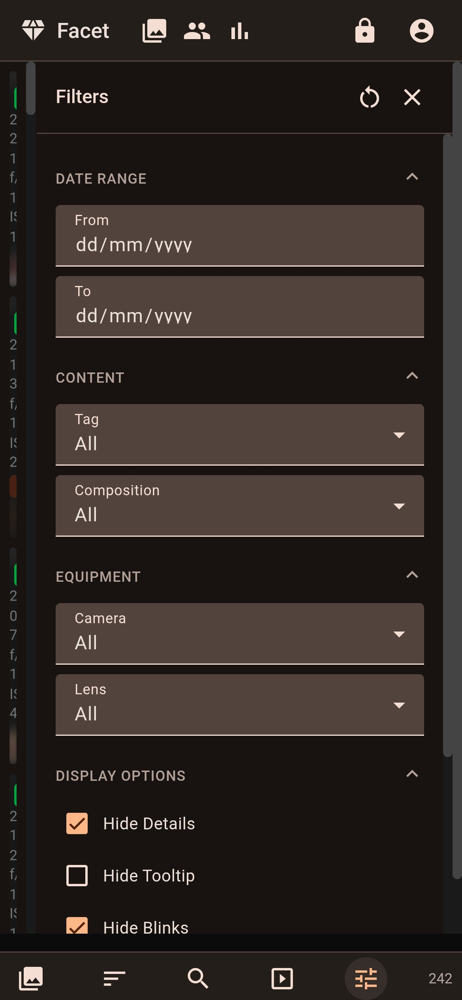

# Facet

**A local-first photo analysis engine that scores, categorizes, and surfaces your best photos using an ensemble of vision models.**

Point Facet at a directory of photos. Local AI models analyze every image across multiple dimensions — aesthetic quality, composition, face detail, technical precision — store scores in a SQLite database, and serve results through an interactive web gallery. Everything runs locally, no cloud, no API keys.


<p align="center">
  
</p>

## Features

### Gallery

Two view modes to browse your library:

- **Mosaic** — justified rows that preserve aspect ratios for an edge-to-edge layout
- **Grid** — uniform card grid with optional metadata overlay showing filename, score, date, EXIF, tags, and recognized faces



Hover over any photo for a detailed tooltip with the full score breakdown (quality, composition, technical metrics) and EXIF data.


### Filters & Search

Filter by date range, content tag, composition pattern, camera, lens, person, and more. Toggle display options like hiding blinks, best-of-burst, duplicates, and rejected photos. Add custom range filters on any metric.


### Find Similar

Select any photo and find visually similar images across your library. Three similarity modes: visual embedding, color palette, and same-person matching. Adjustable similarity threshold.


### Face Recognition

Automatic face detection with InsightFace, HDBSCAN clustering into person groups, and blink detection. The management UI lets you search, rename, merge, and organize person clusters. Filter the gallery by person to browse all photos of someone.

<table><tr>
<td></td>
<td></td>
</tr></table>

### Statistics

Interactive dashboards across four tabs:

- **Gear** — camera and lens usage timelines, average scores by equipment, top body+lens combos
- **Categories** — breakdown by content category with shooting profiles (preferred camera, lens, ISO, aperture, focal length per category)
- **Timeline** — photos per month/year, day-of-week and hour-of-day distributions, shooting hours heatmap
- **Correlations** — configurable multi-metric charts across any axis (year, ISO, aperture, focal length, etc.)

<table><tr>
<td></td>
<td></td>
</tr><tr>
<td></td>
<td></td>
</tr></table>

### Weight Tuning

Per-category weight editor with live preview showing how weight changes affect the top-ranked photos. Includes a correlation chart comparing configured weights vs actual impact on scores. Pairwise A/B photo comparison learns from your choices. Requires edition mode.

<table><tr>
<td></td>
<td></td>
</tr></table>

### Responsive Design

The UI adapts to mobile with a single-column layout, bottom navigation bar, and collapsible filter drawer.

<table><tr>
<td width="50%"></td>
<td width="50%"></td>
</tr></table>

### Multi-Language Support

Available in English, French, German, Spanish, and Italian with a language switcher in the header menu.

## Quick Start

```bash
# Install Python dependencies
python -m venv venv && source venv/bin/activate
pip install -r requirements.txt

# Read docs/INSTALLATION.md for optional/additional packages

# Install Angular frontend
cd client && npm install && npx ng build && cd ..

# Score photos (auto-detects VRAM, uses multi-pass mode)
python facet.py /path/to/photos

# Run the web viewer (FastAPI API + Angular SPA)
python viewer.py
# Open http://localhost:5000
```

VRAM is auto-detected at startup. See [Installation](docs/INSTALLATION.md) for GPU setup and VRAM profile details.

## Documentation

| Document | Description |
|----------|-------------|
| [Installation](docs/INSTALLATION.md) | Requirements, GPU setup, VRAM profiles, dependencies |
| [Commands](docs/COMMANDS.md) | All CLI commands reference |
| [Configuration](docs/CONFIGURATION.md) | Full `scoring_config.json` reference |
| [Scoring](docs/SCORING.md) | Categories, weights, tuning guide |
| [Face Recognition](docs/FACE_RECOGNITION.md) | Face workflow, clustering, person management |
| [Viewer](docs/VIEWER.md) | Web gallery features and usage |
| [Deployment](docs/DEPLOYMENT.md) | Production deployment (Synology NAS, Linux, Docker) |
