# Facet

**A local-first photo analysis engine that scores, categorizes, and surfaces your best photos using an ensemble of vision models.**

Point Facet at a directory of photos. Local AI models analyze every image across multiple dimensions — aesthetic quality, composition, face detail, technical precision — store scores in a SQLite database, and serve results through an interactive web gallery. Everything runs locally, no cloud, no API keys.


<p align="center">
  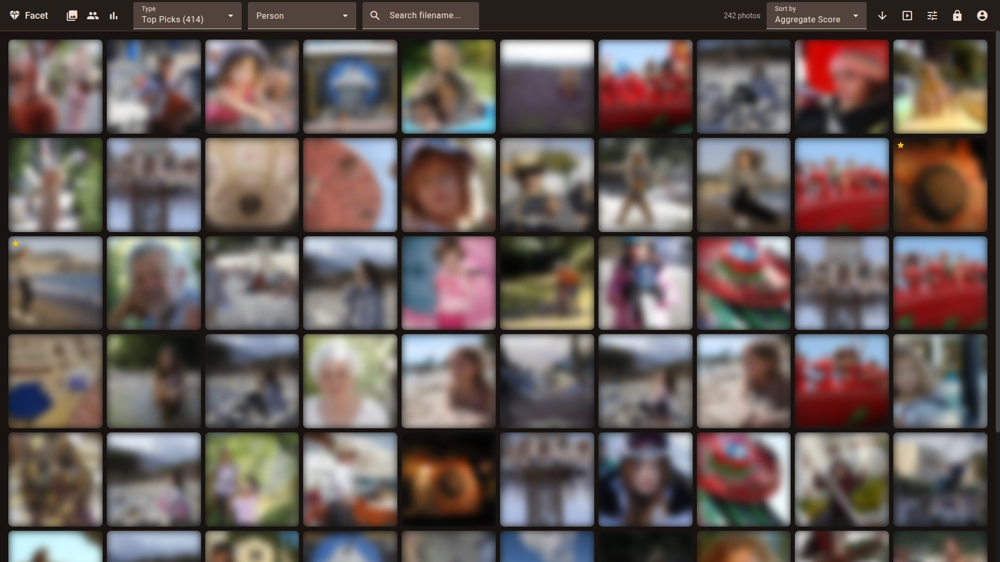
</p>

## Features

### Gallery

Two view modes to browse your library:

- **Mosaic** — justified rows that preserve aspect ratios for an edge-to-edge layout
- **Grid** — uniform card grid with optional metadata overlay showing filename, score, date, EXIF, tags, and recognized faces

Hover over any photo for a detailed tooltip with the full score breakdown (quality, composition, technical metrics) and EXIF data.

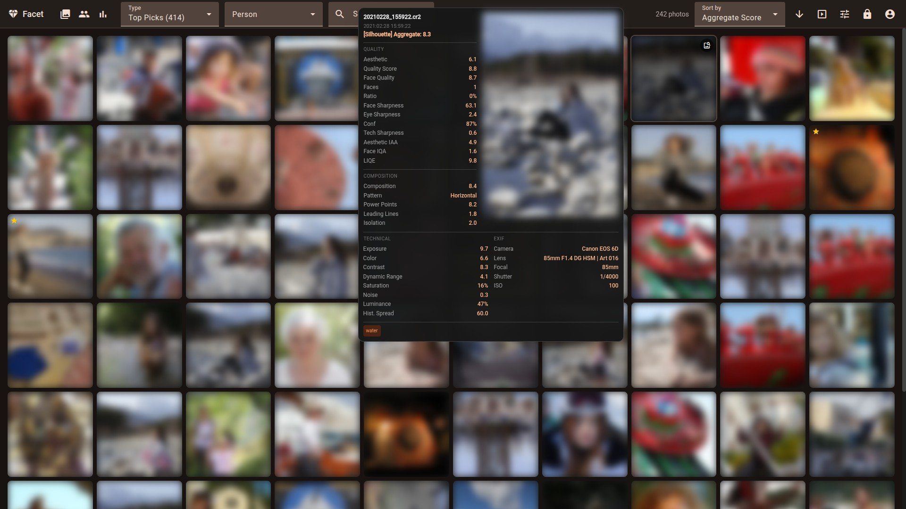

### Filters & Search

Filter by date range, content tag, composition pattern, camera, lens, person, and more. Toggle display options like hiding blinks, best-of-burst, duplicates, and rejected photos. Add custom range filters on any metric.

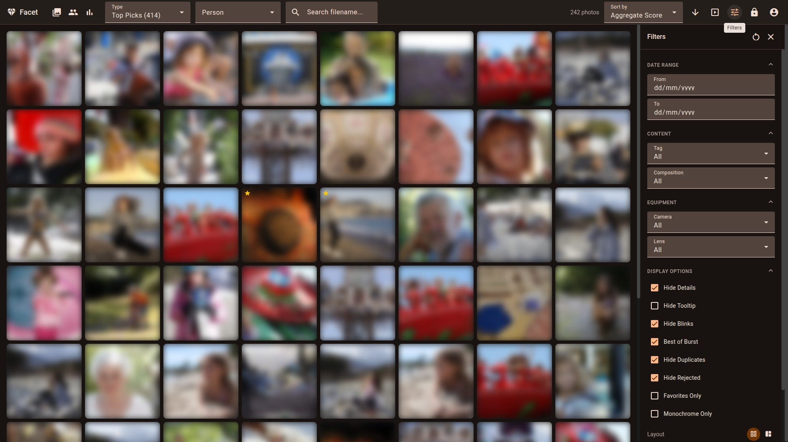

### Find Similar

Select any photo and find visually similar images across your library. Three similarity modes: visual embedding, color palette, and same-person matching. Adjustable similarity threshold.

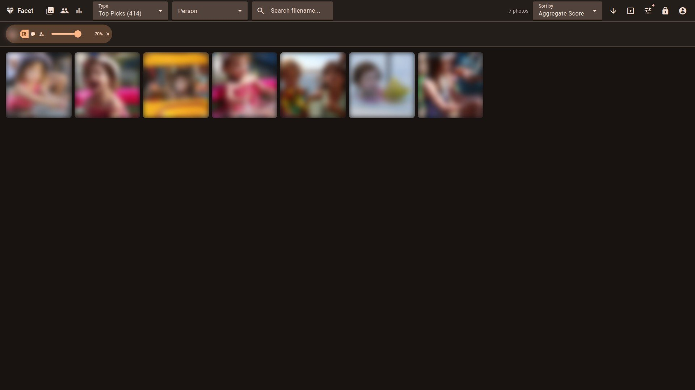

### Face Recognition

Automatic face detection with InsightFace, HDBSCAN clustering into person groups, and blink detection. The management UI lets you search, rename, merge, and organize person clusters. Filter the gallery by person to browse all photos of someone.

<table><tr>
<td>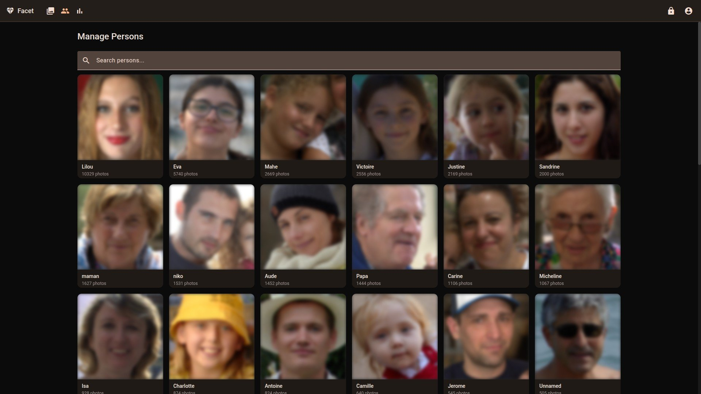</td>
<td>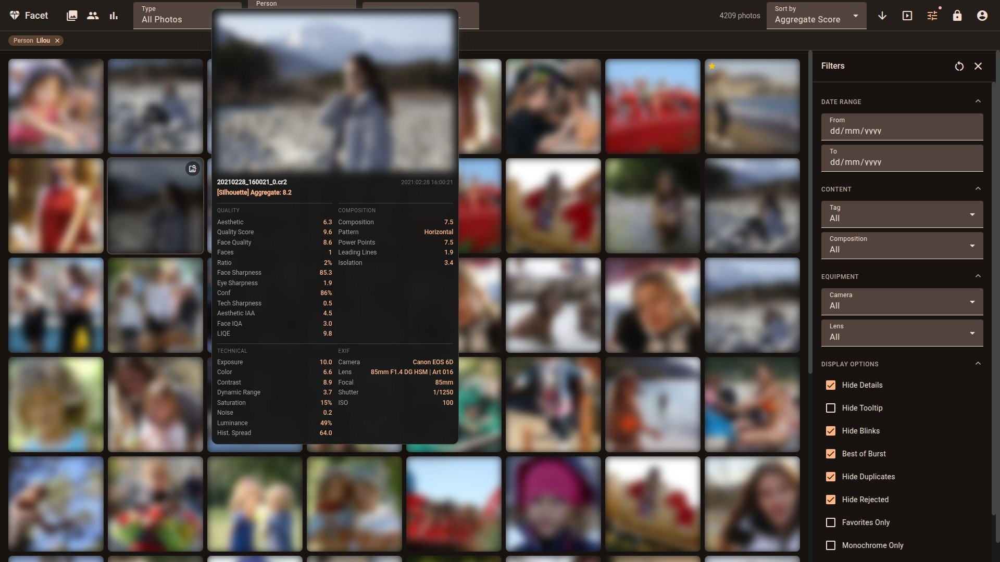</td>
</tr></table>

### Semantic Search

Type a natural-language query — "sunset on the beach", "child playing in snow", "golden hour portrait" — and Facet matches it against stored CLIP/SigLIP embeddings to find semantically matching photos across your library.


### Albums

Organize photos into manual or smart albums. Manual albums let you drag-and-drop photos into collections. Smart albums auto-populate from saved filter combinations (date ranges, tags, camera, person, score thresholds). Each album has a cover photo, description, and photo count.


### Map View

Browse geotagged photos on an interactive Leaflet map. Markers cluster at low zoom levels and expand as you zoom in. Click any marker to view the photo. Extract GPS coordinates from existing photos with `python facet.py --extract-gps` — new photos are extracted automatically during scoring.

### Timeline View

Chronological photo browser with a year/month sidebar for date-based navigation. Scroll through photos organized by date with cursor-based infinite scroll. Access at `/timeline`.

### Memories ("On This Day")

A retrospective dialog showing photos taken on the same calendar date in previous years. Accessible from the gallery header when photos span multiple years.

### AI Captions

VLM-generated natural-language descriptions for each photo — viewable on the photo detail page and editable in edition mode. Generate captions in bulk with `python facet.py --generate-captions`. Requires 16gb or 24gb VRAM profile.

### Photo Sharing

Share albums via tokenized links that require no authentication. Generate a shareable link from any album, and revoke access at any time. Recipients browse the shared album at `/shared/album/:id`.

### AI Critique

Get a detailed score breakdown for any photo. The rule-based critique shows each metric's raw score, category weight, and weighted contribution to the aggregate. Available on all VRAM profiles. VLM-powered critique (16gb/24gb) adds a natural-language assessment.


### Burst Culling

Dedicated culling mode for burst groups. Photos in each burst are shown side-by-side with the auto-computed best shot highlighted. Auto-selection uses aggregate score, aesthetic quality, sharpness, and blink detection. Override any selection with one click, then confirm to mark rejects.


### Statistics

Interactive dashboards across four tabs:

- **Gear** — camera and lens usage timelines, average scores by equipment, top body+lens combos
- **Categories** — breakdown by content category with shooting profiles (preferred camera, lens, ISO, aperture, focal length per category)
- **Timeline** — photos per month/year, day-of-week and hour-of-day distributions, shooting hours heatmap
- **Correlations** — configurable multi-metric charts across any axis (year, ISO, aperture, focal length, etc.)

<table><tr>
<td>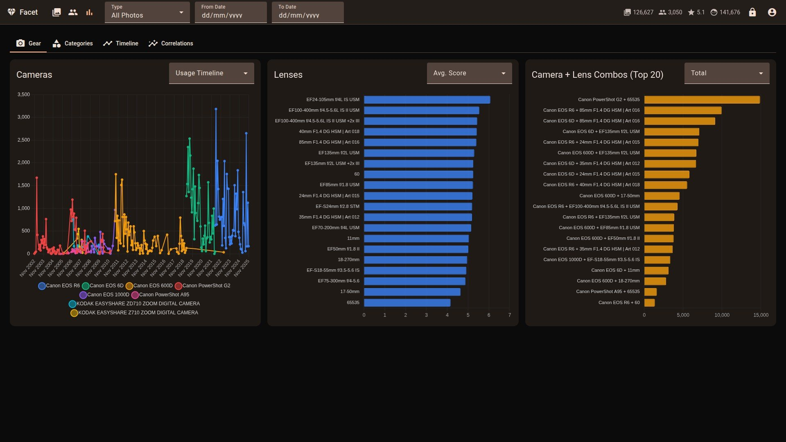</td>
<td>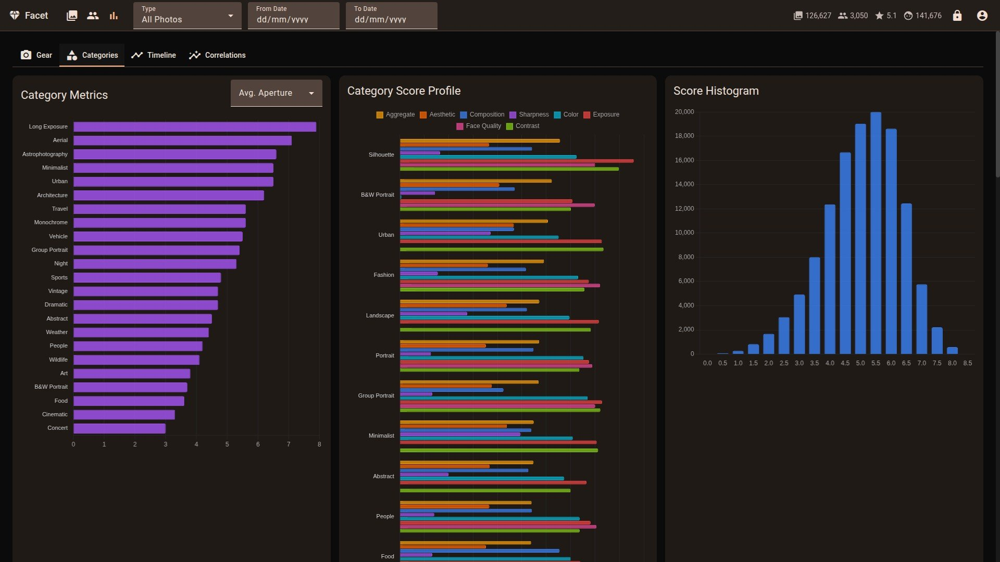</td>
</tr><tr>
<td>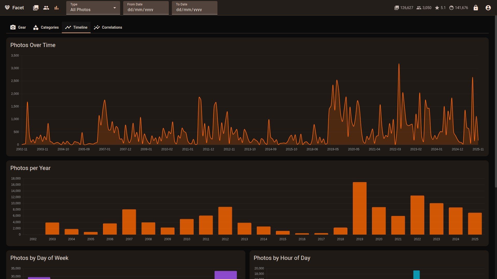</td>
<td>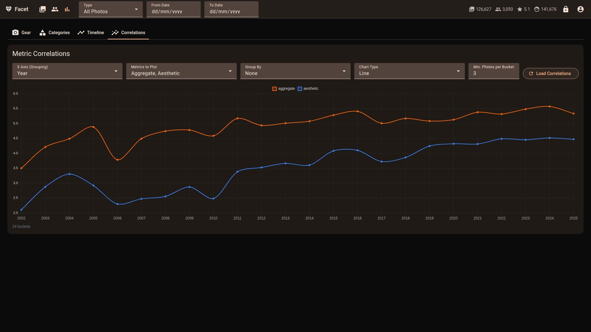</td>
</tr></table>

### Weight Tuning

Per-category weight editor with live preview showing how weight changes affect the top-ranked photos. Includes a correlation chart comparing configured weights vs actual impact on scores. Pairwise A/B photo comparison learns from your choices. Requires edition mode.

<table><tr>
<td>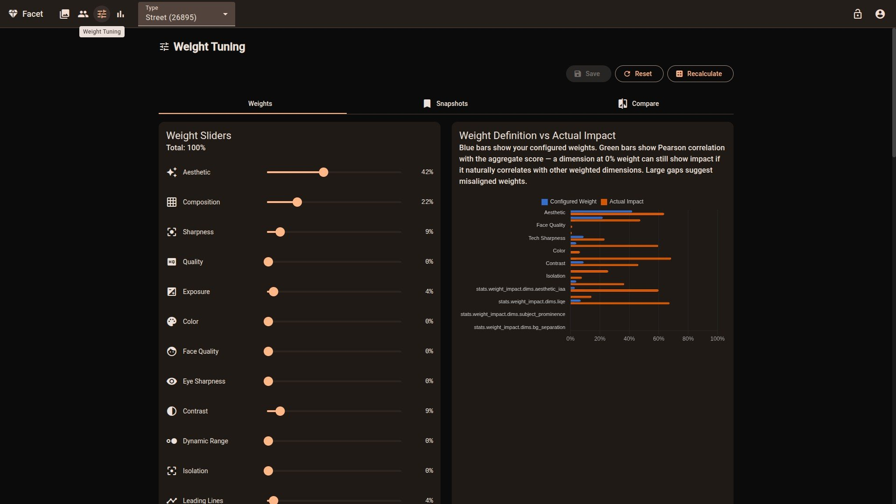</td>
<td>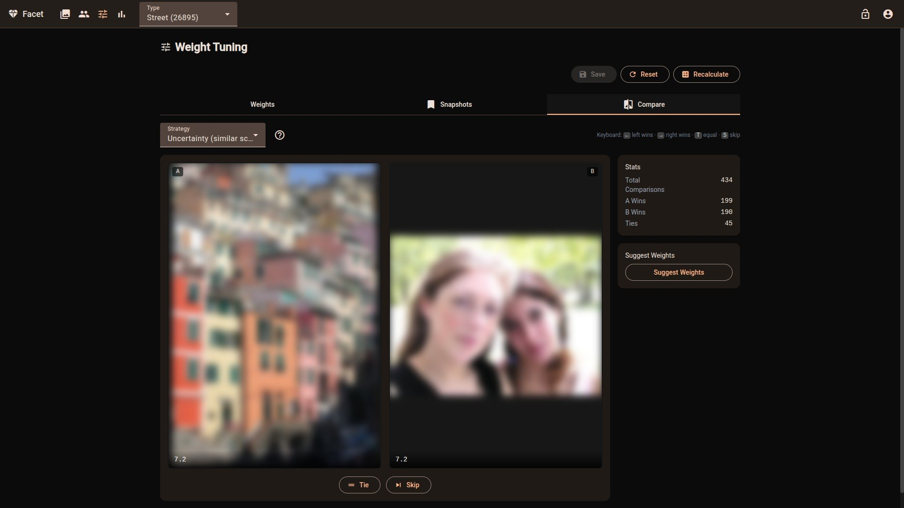</td>
</tr></table>

### Snapshots

Save and restore weight configurations as named snapshots. Compare different tuning approaches side-by-side, roll back to a previous configuration, or share setups across machines via export/import.


### Ratings & Favorites

Star ratings (1-5), favorites, and reject flags on any photo. Cycle through star ratings with a single click in edition mode. Filter the gallery by rating, favorites-only, or hide rejected photos. Ratings are stored in the database and persist across sessions.

### Batch Operations

Multi-select photos with Shift+click for range selection or Ctrl+click for individual picks. The action bar lets you set star ratings, toggle favorites, mark as rejected, or add to albums in bulk. Select all visible photos with one click.

### Slideshow

Full-screen slideshow mode with configurable interval and keyboard controls. Navigate forward/back, pause/resume, or exit at any time. Launches from the gallery toolbar and respects current filters and sort order.

### Dark & Light Mode

Toggle between dark and light themes from the user menu. Respects your system preference (`prefers-color-scheme`) by default. Combines with 10 accent color themes.

### Responsive Design

The UI adapts to any screen size — from mobile (single-column, bottom nav) to tablet (compact grid) to desktop (full mosaic with sidebar).

<table><tr>
<td width="33%">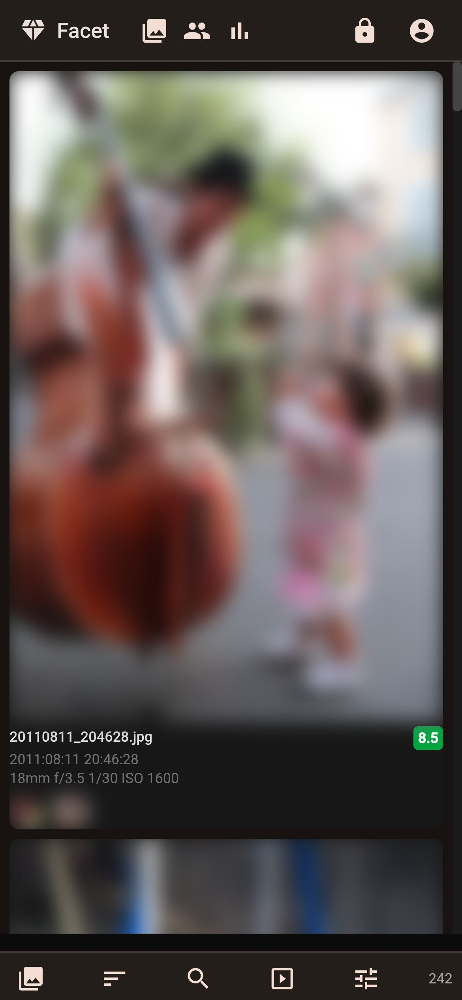</td>
<td width="33%"></td>
<td width="33%"></td>
</tr></table>

### Multi-Language Support

Available in English, French, German, Spanish, and Italian with a language switcher in the header menu.

### Plugin & Webhook System

Extend Facet with custom plugins and webhooks. Events: `on_score_complete`, `on_new_photo`, `on_burst_detected`, `on_high_score`. Built-in actions include copying high-scoring photos to a folder. See `plugins/example_plugin.py` for the interface.

## Quick Start

### Docker (recommended)

```bash
docker compose up
# Open http://localhost:5000
```

GPU acceleration requires the [NVIDIA Container Toolkit](https://docs.nvidia.com/datacenter/cloud-native/container-toolkit/install-guide.html). Mount your photos directory in `docker-compose.yml`.

### Manual Install

```bash
git clone https://github.com/ncoevoet/facet.git && cd facet
bash install.sh          # auto-detects GPU, creates venv, installs everything
python facet.py /photos  # score photos
python viewer.py         # start web viewer → http://localhost:5000
```

The install script auto-detects your CUDA version, installs the right PyTorch variant, builds the Angular frontend, and verifies all imports. Options: `--cpu` (force CPU), `--cuda 12.8` (override CUDA version), `--skip-client` (skip frontend build).

<details>
<summary>Step-by-step manual install</summary>

```bash
# 1. Install exiftool (optional but recommended)
# Ubuntu/Debian: sudo apt install libimage-exiftool-perl
# macOS:         brew install exiftool

# 2. Create virtual environment
python -m venv venv && source venv/bin/activate

# 3. Install PyTorch with CUDA (pick your version at https://pytorch.org/get-started/locally)
pip install torch torchvision --index-url https://download.pytorch.org/whl/cu128

# 4. Install Python dependencies (all at once — see Troubleshooting if you hit conflicts)
pip install -r requirements.txt

# 5. Install ONNX Runtime for face detection (choose ONE)
pip install onnxruntime-gpu>=1.17.0   # GPU (CUDA 12.x)
# pip install onnxruntime>=1.15.0     # CPU fallback

# 6. Build Angular frontend
cd client && npm ci && npx ng build && cd ..

# 7. Score photos and start viewer
python facet.py /path/to/photos
python viewer.py
```
</details>

### PyPI

```bash
pip install facet-photo
facet /path/to/photos        # Score photos
facet-viewer                 # Start the web viewer
facet-doctor                 # Diagnose GPU issues
```

Run `python facet.py --doctor` to diagnose GPU issues. See [Installation](docs/INSTALLATION.md) for VRAM profiles, VLM tagging packages (16gb/24gb), optional dependencies, and [dependency troubleshooting](docs/INSTALLATION.md#troubleshooting-dependency-conflicts).

## Configuration

All settings live in `scoring_config.json`. Key sections:

| Section | Purpose |
|---------|---------|
| `categories` | Photo categories with weights, filters, and tag vocabulary |
| `viewer` | UI defaults, sort options, feature flags, CORS origins |
| `storage` | Storage mode (`database` or `filesystem`) |
| `plugins` | Webhook URLs and built-in actions |
| `performance` | SQLite mmap and cache sizing |

Environment variables: `FACET_LOG_LEVEL` (DEBUG/INFO/WARNING/ERROR), `PORT` (default 5000), `FACET_DB_PATH`.

See [Configuration](docs/CONFIGURATION.md) for the full reference.

## API

The FastAPI server exposes a REST API documented at `/api/docs` (Swagger UI) when running.

Key endpoints:

| Endpoint | Purpose |
|----------|---------|
| `GET /health` | Liveness check |
| `GET /ready` | Readiness check (database connectivity) |
| `GET /api/photos` | Paginated photo list with filters |
| `GET /api/search?q=...` | Semantic text-to-image search |
| `GET /api/burst-groups` | Burst groups for culling mode |
| `GET /api/plugins` | Loaded plugins and webhooks |

## Documentation

| Document | Description |
|----------|-------------|
| [Installation](docs/INSTALLATION.md) | Requirements, GPU setup, VRAM profiles, dependencies |
| [Commands](docs/COMMANDS.md) | All CLI commands reference |
| [Configuration](docs/CONFIGURATION.md) | Full `scoring_config.json` reference |
| [Scoring](docs/SCORING.md) | Categories, weights, tuning guide |
| [Face Recognition](docs/FACE_RECOGNITION.md) | Face workflow, clustering, person management |
| [Viewer](docs/VIEWER.md) | Web gallery features and usage |
| [Deployment](docs/DEPLOYMENT.md) | Production deployment (Synology NAS, Linux, Docker) |
| [Contributing](CONTRIBUTING.md) | Development setup, architecture, code style |

## License

[MIT](LICENSE)
